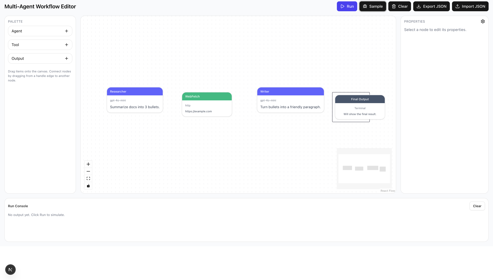

Absolutely. Here’s a **first-draft `README.md`** tailored for your open-source, flowchart-based multi-agent playground. It balances clarity for new users, excitement for contributors, and technical credibility for developers.

It is a work in progress...



---
# 🧠 Multi-Agent Workflow Studio

> A visual playground for designing, running, and sharing multi-agent AI workflows — no backend, no setup, no hassle.
---

## ✨ Overview

**Multi-Agent Workflow Studio** lets you drag-and-drop **agents**, **tools**, and **outputs** into a visual flowchart, connect them, and instantly simulate how they interact.  
It’s a lightweight sandbox for testing **agentic AI ideas** without having to spin up servers, write glue code, or manage APIs.

- 🧩 **Flowchart-style editor** – build agent pipelines visually with React Flow.  
- ⚡ **Mock or Live** mode – toggle between fake responses and real LLM calls.  
- 🔌 **Extensible providers** – add new LLMs (OpenAI, Anthropic, Ollama, etc.) via small adapter files.  
- 📦 **JSON-based flows** – save, load, and share your prototypes easily.  
- 🪄 **Zero setup** – everything runs locally in the browser or via a single Next.js dev server.

---

## 🚀 Quickstart

### 1. Clone and install

```bash
git clone https://github.com/<yourname>/multi-agent-workflow-studio.git
cd multi-agent-workflow-studio
pnpm install
````

### 2. Run in mock mode

```bash
pnpm dev
```

Open [http://localhost:3000](http://localhost:3000) – you’ll see the drag-and-drop canvas with sample nodes.

> 🧩 **No API keys required**.
> Everything runs in **mock mode** until you add real providers.

### 3. Try a sample flow

* Click **Sample Flow** in the toolbar, or
* Import `/examples/research-write.flow.json`.

Then press **▶ Run** to simulate the workflow. Logs appear in the bottom console.

---

## 🔑 Going Live (optional)

When you’re ready to test with real models:

1. Open **Settings → Environments**.
2. Add your API key(s) – stored **only in localStorage** (never uploaded).
3. Switch a node’s **mode** from `mock` → `live`.
4. Run again. You’ll see actual model responses streaming in.

Supports (initially):

* OpenAI (`gpt-4o-mini`, etc.)
* Ollama (local models)
* Anthropic (coming soon)

---

## 🧱 Architecture

| Layer               | Description                                          |
| ------------------- | ---------------------------------------------------- |
| **Frontend**        | Next.js + TypeScript + React Flow                    |
| **State**           | Zustand for UI state; JSON export for persistence    |
| **UI**              | Tailwind CSS + shadcn/ui (Radix primitives)          |
| **Runner**          | DAG-based engine with mock + live modes              |
| **Schema**          | Versioned `flow.v1.json` format (validated with zod) |
| **Providers/Tools** | Extensible plugin registry                           |

No backend is required.
All flows, keys, and runs live locally as JSON until you opt into a real API.

---

## 🧩 Flow Format

Flows are portable `.json` files that look like this:

```json
{
  "version": "1.0.0",
  "flow": {
    "name": "Research → Write",
    "nodes": [
      { "id": "a1", "type": "agent", "mode": "mock", "config": { "prompt": "Summarize topic." } },
      { "id": "t1", "type": "tool", "mode": "mock", "config": { "toolId": "web-search" } },
      { "id": "o1", "type": "output", "mode": "mock", "config": {} }
    ],
    "edges": [
      { "id": "e1", "source": "a1", "target": "t1" },
      { "id": "e2", "source": "t1", "target": "o1" }
    ]
  }
}
```

See [`docs/flow-format.md`](docs/flow-format.md) for the full schema.

---

## 🧰 Tech Stack

* **Frontend**: [Next.js](https://nextjs.org/), [TypeScript](https://www.typescriptlang.org/)
* **Canvas**: [React Flow](https://reactflow.dev/)
* **UI**: [Tailwind CSS](https://tailwindcss.com/) + [shadcn/ui](https://ui.shadcn.com/)
* **State Management**: [Zustand](https://zustand-demo.pmnd.rs/)
* **Validation**: [zod](https://zod.dev/)
* **Icons**: [lucide-react](https://lucide.dev/)
* **Build**: [pnpm](https://pnpm.io/), [Vercel](https://vercel.com/) (optional)

---

## 🧪 Development

```bash
# run dev server
pnpm dev

# lint & typecheck
pnpm lint
pnpm typecheck

# run tests
pnpm test
```

---

## 🌍 Sharing & Collaboration

Flows are portable JSON files — just export and share them:

```bash
📁 examples/
├── research-write.flow.json
├── two-agent-debate.flow.json
└── rag-summary.flow.json
```

Anyone can import a `.flow.json` file and run it instantly.

---

## 🧑‍💻 Contributing

Contributions are welcome! ❤️

1. Fork the repo
2. Create a feature branch:
   `git checkout -b feature/new-tool`
3. Commit your changes
4. Open a PR

See [`CONTRIBUTING.md`](CONTRIBUTING.md) for setup, code style, and testing details.

We follow the [Contributor Covenant](CODE_OF_CONDUCT.md).

---

## 📦 Roadmap

* [ ] Flow editor MVP (React Flow)
* [ ] Mock runner & console
* [ ] Environment setup screen
* [ ] Live execution via OpenAI/Ollama
* [ ] Tool plugins (RAG, Web Search, HTTP)
* [ ] JSON schema validation + examples
* [ ] Docs site with guides & templates

See [ROADMAP.md](docs/ROADMAP.md) for current milestones.

---

## 🛡️ License

MIT © 2025 Lawrence Moore

---

