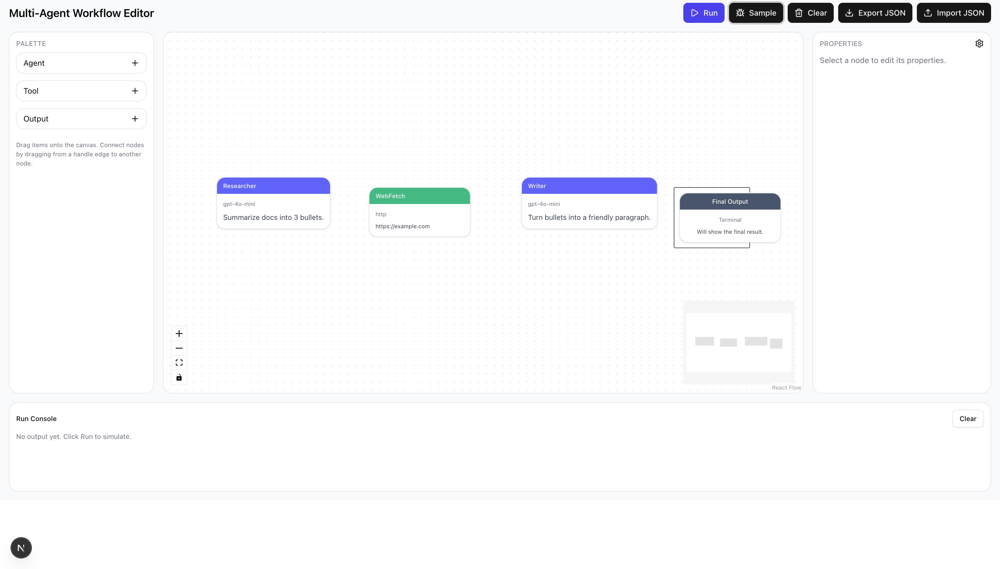

# inference-sandbox

A visual, node-based editor for designing, executing, and evaluating multi-agent AI workflows across multiple LLM providers.



## What it does

Build workflows by connecting nodes on a canvas — Prompt, Agent, Tool, Router, Document, Chunker, and Result. Run them against real LLM APIs and compare outputs across providers side by side.

**Supported providers:** OpenAI, Anthropic (Claude), Google AI (Gemini), Ollama (local/custom models)

## Features

- **Visual canvas** — drag-and-drop node editor powered by React Flow
- **Multi-provider execution** — run the same workflow against N providers in parallel
- **Compare Mode** — view outputs side by side with synchronized scrolling *(coming in Phase 1)*
- **Shadow Test Mode** — diff your local Ollama model against a frontier model *(coming in Phase 1)*
- **Streaming** — real-time token-by-token output display
- **Document processing** — PDF, TXT, MD, and code file support with chunking
- **Cost tracking** — per-run token usage and estimated cost per provider
- **Import/export** — save and share workflows as JSON

## Quick start (local, no backend)

```bash
# Prerequisites: Node.js 20+, pnpm
git clone https://github.com/MyLightIsOn/inference-sandbox.git
cd inference-sandbox
pnpm install
pnpm dev
```

Open [http://localhost:3000](http://localhost:3000). No API keys required for mock mode.

To use live LLM execution, click the ⚙️ Settings button and add your API keys.

## Self-hosting with Supabase (optional)

Supabase adds persistent run history, annotations, and shareable snapshots. Without it, the app works fully in localStorage mode.

> Self-hosting setup (docker-compose, .env.local.example) is added in Phase 0 Task 15. See `docs/SELF_HOSTING.md` once that task is complete.

## Tech stack

- **Framework:** Next.js 16 (App Router), React 19, TypeScript 5
- **Canvas:** React Flow (`@xyflow/react`)
- **Styling:** Tailwind CSS 4, shadcn/ui
- **LLM SDKs:** openai, @anthropic-ai/sdk, @google/generative-ai
- **Backend (optional):** Supabase (Postgres + auth + storage)
- **Tests:** Vitest
- **Deployment:** Vercel

## Roadmap

| Phase | Feature | Status |
|-------|---------|--------|
| 1 | Compare Mode — run N providers simultaneously | Planned |
| 1 | Shadow Test Mode — diff local vs frontier models | Planned |
| 2 | Qualitative Annotation — rate and annotate outputs | Planned |
| 2 | Run Observability — latency, tokens, cost per node | Planned |
| 3 | Run History — persistent log with filters and trends | Planned |
| 3 | Shareable Snapshots — export runs as HTML or URL | Planned |
| 4 | Prompt Versioning — track prompt changes across runs | Planned |
| 4 | Template Library — curated community workflow templates | Planned |

## Contributing

See [CONTRIBUTING.md](CONTRIBUTING.md). Issues and PRs welcome.

## License

MIT — see [LICENSE](LICENSE)
